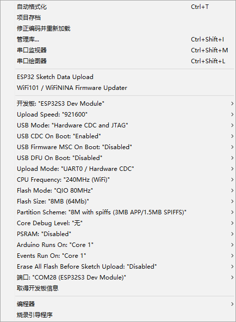

# M5STACK AirQ User Demo

## Supported framework

- Arduino IDE
- PlatformIO (Recommended)

## Arduino IDE

1. For Arduino IDE installation, please refer to https://docs.m5stack.com/en/arduino/arduino_ide.

2. Install the following dependent libraries:

    - [m5stack/M5GFX @ 0.1.16](https://github.com/m5stack/M5GFX/tree/0.1.16)
    - [m5stack/M5Unified @ 0.1.16](https://github.com/m5stack/M5Unified/tree/0.1.16)
    - [Sensirion/Sensirion Core 0.7.1](https://github.com/Sensirion/arduino-core/tree/0.7.1)
    - [sensirion/Sensirion I2C SEN5X 0.3.0](https://github.com/Sensirion/arduino-i2c-sen5x/tree/0.3.0)
    - [sensirion/Sensirion I2C SCD4x @ 0.4.0](https://github.com/Sensirion/arduino-i2c-scd4x/tree/0.4.0)
    - [tanakamasayuki/I2C BM8563 RTC @ 1.0.4](https://github.com/tanakamasayuki/I2C_BM8563/tree/1.0.4)
    - [mathertel/OneButton @ 2.0.3](https://github.com/mathertel/OneButton/tree/2.0.3)
    - [bblanchon/ArduinoJson @ 6.21.3](https://github.com/bblanchon/ArduinoJson/tree/v6.21.3)

3. Install ESP32 LittleFS Uploader

    1. Arduino IDE 1.8.x: [Install ESP32 LittleFS Uploader](https://randomnerdtutorials.com/install-esp32-filesystem-uploader-arduino-ide/)

    2. Arduino IDE 2.x: [Install ESP32 LittleFS Uploader](https://randomnerdtutorials.com/arduino-ide-2-install-esp32-littlefs/)

4. Click `upload` , Wait for compilation and writing to complete.

    

5. Then, upload the files to the ESP32 board. Press [Ctrl] + [Shift] + [P] on Windows or [⌘] + [Shift] + [P] on MacOS to open the command palette. Search for the Upload LittleFS to Pico/ESP8266/ESP32 command and click on it.

## PlatformIO (Recommended)

1. Install [Visual Studio Code](https://code.visualstudio.com/) and [Python](https://www.python.org/)

2. Search for the `PlatformIO` plugin in the `VisualStudioCode` extension and install it.

3. After the installation is complete, you need to restart `VisualStudioCode`

4. After restarting `VisualStudioCode`, select `File` in the upper left corner of `VisualStudioCode` -> `Open Folder` -> select the `AirQUserDemo` directory

5. Wait for the installation of third-party dependent libraries to complete

6. Click `→` to upload firmware

7. Click `Upload Filesystem Image` or enter `pio run -t uploadfs` in the PlatformIO terminal to upload filesystem firmware
